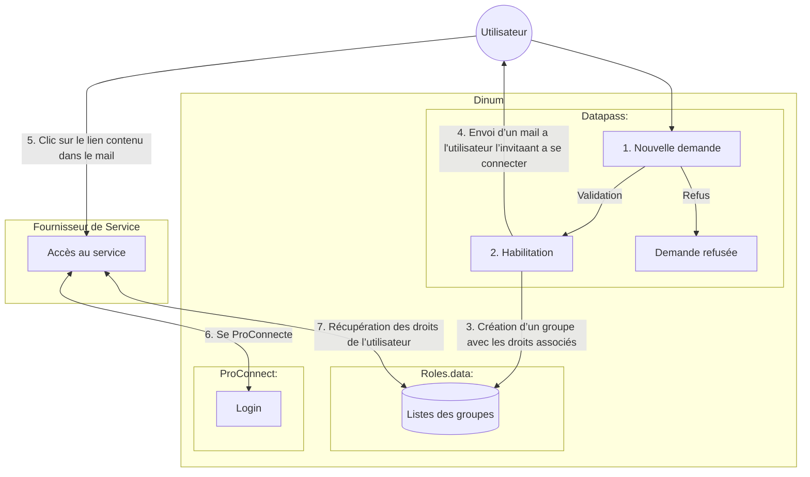

# Présentation de rôles.data

## Un nouveau schéma d’habilitation

**Avantages :** 
- authentification, habilitation et délégation mutualisées et sécurisée
- charge technique réduite
- ouvre la possibilité du partage de groupe entre les produits
- parcours unifié, centré sur ProConnect

**Désavantages :**
- perte d’ownership et d'agilité pour le FS

