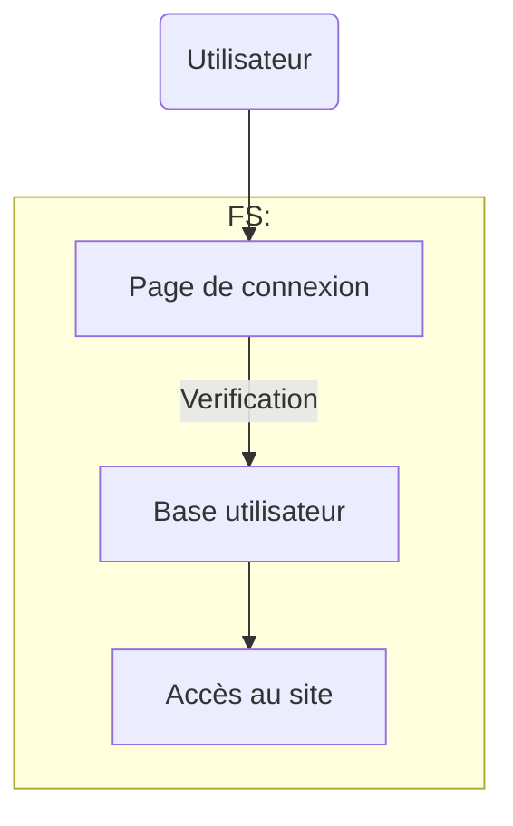
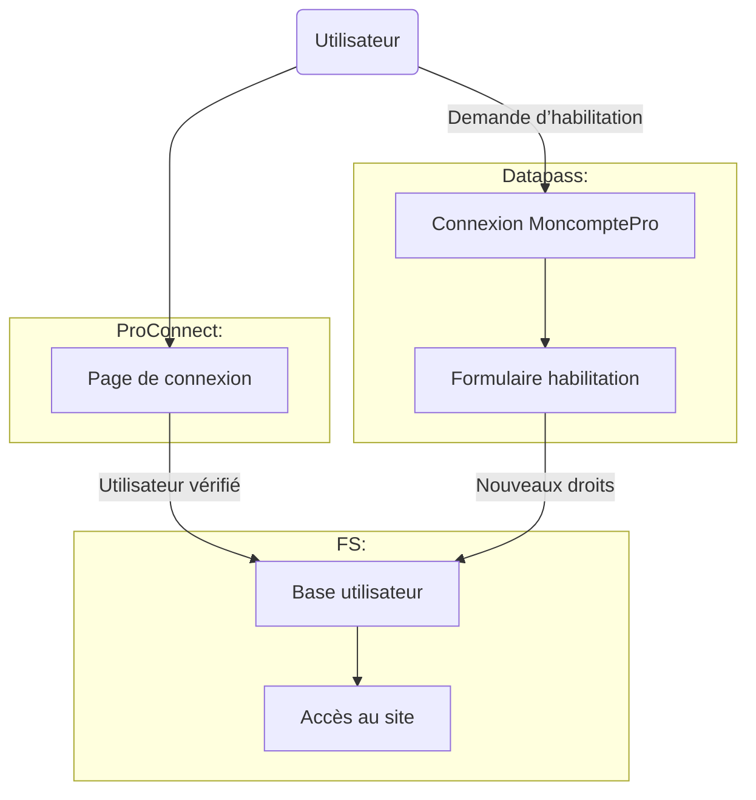
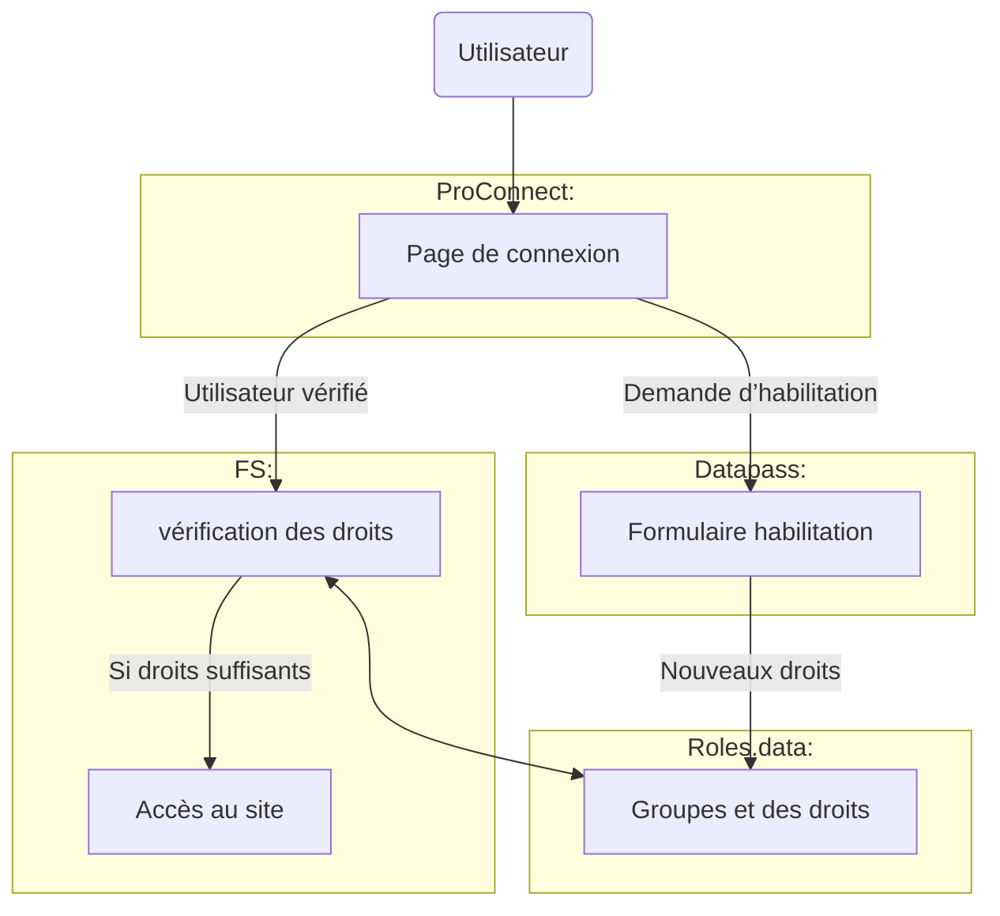

# Présentation de rôles.data

## Pourquoi rôles.data

### Avant

Avantages : 
- contrôle technique sur toute la chaine

Désavantages
- charge technique de toute la chaine
- pas de mutualisation des bases utilisateurs 
- gestion des habilitations/demandes d’accès minimaliste

### Aujourd'hui (outils opérateur)

Avantages : 
- authentification et habilitation mutualisée
- charge technique réduite

Désavantages
- perte d’ownership et d'agilité pour le FS
- lourdeur du parcours
  - MCP <> ProConnect
  - pas de délégation de droits (besoin de faire un datapass par user)

### Demain (avec rôles.data)

Avantages : 
- authentification, habilitation et délégation mutualisées
- charge technique réduite
- ouvre la possibilité du partage de groupe entre les produits
- parcours unifié, centré sur ProConnect

Désavantages
- perte d’ownership et d'agilité pour le FS

NB: possibilité d'aller bien plus loin dans l'intégration ProConnecto, Datapasso et Rolo
