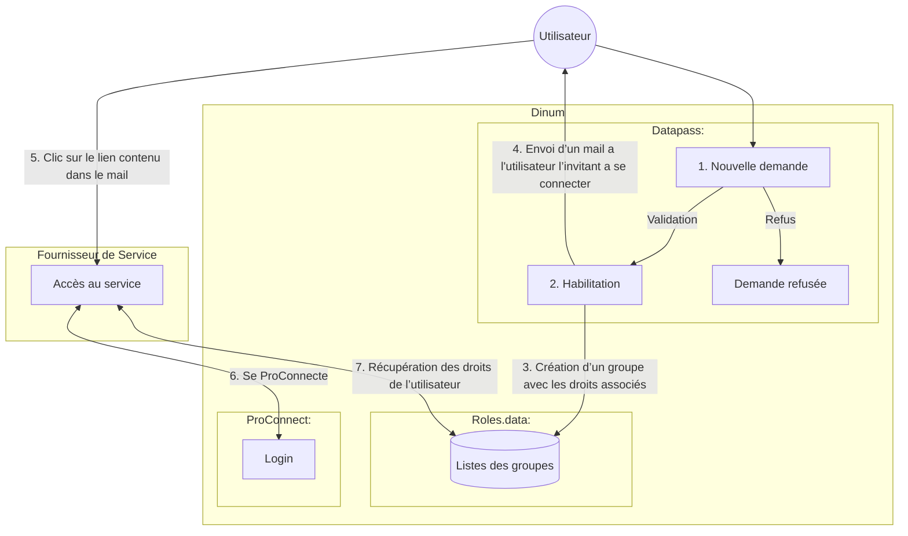
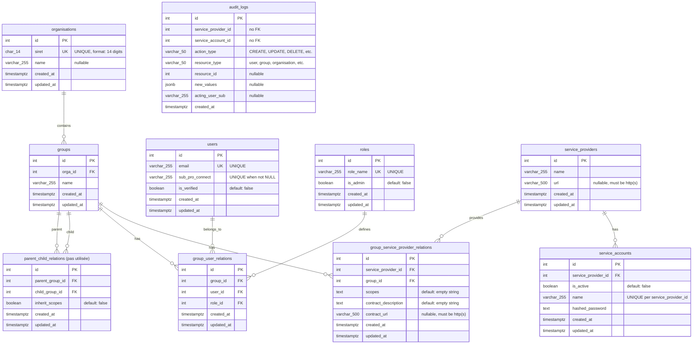
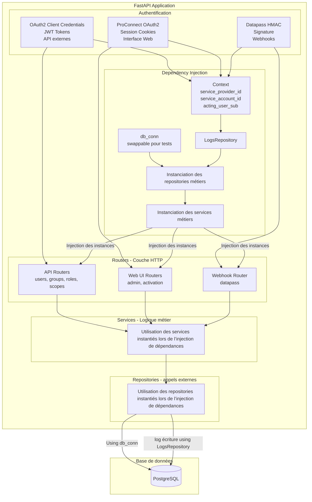

# Roles.data

[](https://github.com/datagouv/roles.data/actions/workflows/integration_tests.yml)
[](https://github.com/datagouv/roles.data/actions/workflows/create-deploy-release.yml)

API de gestion des droits utilisateurs pour les outils du pôle DATA. Pour en savoir plus, [découvrez la présentation](PRESENTATION.md).

## Table des matières

- [Installation](#installation)
- [Configuration docker](#configuration-docker)
- [Base de données](#base-de-données)
- [Tests](#tests)
- [Déploiements](#déploiements)
- [Conventions de code](#conventions-de-code)
- [Contribuer](#contribuer)

## Installation

### Prérequis

- Python 3.13+
- [uv](https://docs.astral.sh/uv) - Gestionnaire de dépendances
- PostgreSQL 15.7
- Docker & Docker Compose

### Installation rapide

```bash
# Cloner le dépôt
git clone https://github.com/datagouv/roles.data.git
cd roles.data

# Installer les dépendances
uv sync

# Lancer les conteneurs de base de données
make docker_local

# Initialiser & migrer la base de données
make db_init

# Lancer l'application
make start
```

NB : en mode developpement rapide, l'application n’est pas dockerisée. Seuls les containers de la base de donnée le sont.

## Configuration docker

Pour tester la configuration docker complète de l'application :

```
make docker
```

La commande lance les containers :

- nginx (cf `./nginx.conf`)
- app
- postgres-local
- postgres-test
- smtp-local

Ce mode permet de tester la conf nginx, le dockerfile et la logique de migration.

Cette commande est systématiquement testée dans la CI par la Github Action `docker-config-test`

## Base de données

### environnements

La variable `DB_ENV` est utilisée pour distinguer les différents environnements :

- `local` : developpement local (seedé)
- `test` : CI (seedé)
- `dev` : intégration (seedé)
- `prod` environnement de production

### local

```
# lancer les DB pour les environnements local et test
docker-compose-up

# se connecter
psql -h localhost -p 5432 -U d-roles -d d-roles

# executer les migrations et la seed
make db_init
```

### Scripts de provisionnement de la base de données

Les scripts appliqués à la base de donnée sont executés dans cet ordre :

- `schema.sql` - creation du schema (uniquement les environnements local, test)
- `create.sql` - création de la base de données
- `migrations/*` - migrations successives
- `seed.sql` - données de tests (uniquement les environnements local, test, dev)

#### Migrations

Ajouter un fichier `db/migrations/{YYYYMMDD}_{description}.sql` avec le SQL nécessaire pour la migration

#### Seed

Mettre a jour le fichier seeds (selon l'environnement) dans `db/seeds/{environnement}/seed.sql`

## Tests

Les tests d'intégration tournent sur pytest. La DB postgres-test est une DB différent de la DB de dev, pré-stubbé et isolée.

```
# démarrer la DB
make docker_local

# test de migrations/seed
# make db_init

# lancer les tests
make test
```

## Déploiements

L'application est déployée sur différents environnements :

- [dev] https://roles.dev.data.gouv.fr : données de test. À utiliser pour en intégration.
- [prod] https://roles.data.gouv.fr

Les déploiement se font via un message de commit formaté de la manière suivante : [ENV:VERSION].

```
# deploy on roles.dev.data.gouv.fr
make deploy_dev

# deploy on roles.data.gouv.fr
make deploy_prod
```

NB : ces commandes déploient la branche `main` uniquement.

## Conventions de code

### Pre-commit

```
uv add pre-commit
pre-commit install --install-hooks
```

### Formatting et linting

Ce projet utilise Ruff pour le formatage et le linting :

```
make lint
```

## Contribuer

Cf [documentation contributeur](CONTRIBUTING.md)


## Comprendre l'architecture

### Le parcours utilisateur



### Le schéma relationnel de la base de données

Le schéma ci-dessous représente la structure de la base de données (selon les migrations, ce schéma peut différer légèrement de la structure réelle) :



**Notes importantes :**
- `Datapass` (id=999) est le seul fournisseur de service hardcodé
- `group_service_provider_relations` : association many-to-many entre groupes, et fournisseurs de service, qui porte les droits(scopes)
- `group_user_relations` : association many-to-many entre groupes, utilisateurs et rôles
- `audit_logs` n'utilise pas de clés étrangères pour conserver l'historique même après suppression de la ressource
- `parent_child_relations` permet de créer une hiérarchie de groupes (la table existe mais n’est pas actuellement utilisée)


### Architecture technique



**Patterns d'authentification :**
- **OAuth2 Client Credentials** : Service accounts avec JWT pour les API externes
- **ProConnect OAuth2** : Authentication utilisateur via OpenID Connect pour l'interface web
- **Datapass HMAC** : Vérification de signature pour les webhooks entrants

**Injection de dépendances :**
- **Context** : Extrait des credentials d'authentification, contient `service_provider_id`, `service_account_id`, `acting_user_sub`
- **DB Connection** : Session de base de données (`db_session`), swappable pour les tests (permet d'utiliser une DB de test isolée)
- **LogsService** : Injecté avec le context pour tracer les actions dans `audit_logs`

**Architecture en couches :**
- **Routers** : Gestion des requêtes HTTP, validation des entrées, sérialisation des réponses
- **Services** : Logique métier, orchestration entre repositories, gestion des emails
- **Repositories** : Requêtes SQL directes, transactions, logging des actions via LogsService
